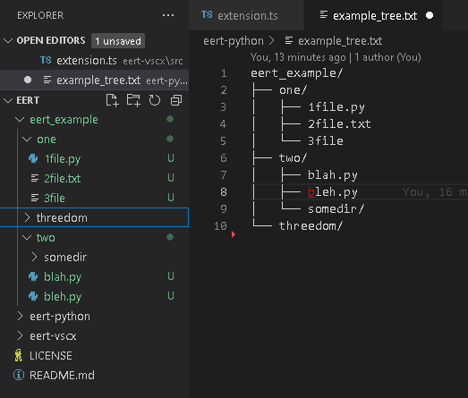

###~~a recent attempt to use it shows I broke something in the python version.~~

the pure bash, python, and vscode extension versions are all working. 

# retree - inverse tree utility

This tool essentially inverts what /usr/bin/tree -F does. It creates a real directory structure on your filesystem based on an ascii line-art tree. 

## Why?
Let's say a README shows you a tree listing, suggesting you create the same. Or an architecture/requirements document does similarly. 

Or (as was my impetus for creating this) an LLM presents you with an example structure when you ask it to look at your code and suggest a sensible grouping of the classes within your single file into some number of separate files for packaging in a library you plan to make public. 

Sure, you could manually mkdir and touch files, or you could slowly watch it come into existence as you refactor your code into multiple directories and files, but if you're like me, you want to see it on your filesystem *now* and make changes and piecemeal refactor bits here and there, so you'd like to have the structure already exist, even as empty files. (And of course, the ability to use a source of truth diagram in the form of a text art directory tree without the potential for fatfingering or overlooking something when creating a real layout on a real filesystem is an obvious plus.)

## What? 
### Now included is a bash version because I nerd-sniped myself after answering a decade+ old question asking how to accomplish this in bash.
[My answer on stackoverflow](https://stackoverflow.com/a/79106673/27893564) showed the usage from the python script below, but after I posted the answer, it bothered me that the question was asked as a bash question and my answer required python. So...

```bash
$ git clone https://github.com/scottvr/retree/
$ cd retree/retree-bash
$ tree -F
.
└── retree.sh*

0 directories, 1 file

$ mkdir test && cd test
$ bash ../retree.sh < ../../example_tree.txt
$ tree -F
.
└── retree_example
    ├── one
    │   ├──     1file.py*
    │   ├──     2file.txt*
    │   └──     3file
    ├── threedom
    └── two
        ├──     blah.py*
        ├──     bleh.py*
        └──     somedir

6 directories, 5 files
```

### example_tree above, described in haiku
---

```
.
└── retree_example/
retree_example
branches split, names whispering  
of purpose not yet
    ├── one
    three files lie in wait  
    Python, text, the mystery  
    of the third unnamed
    ├── threedom
    a name, not a count  
    boldly standing on its own  
    liberation lives
    └── two
    blah and bleh debate
    code or noise — both wear .py
    somedir just shrugs
```

### Included is a Python tool that takes stdin and does the needful. for example 
```bash
git clone https://github.com/scottvr/retree/
cd retree/retree-python
# copy a structure (but not file contents) from some example directory:
tree -F /home/user/example | python retree.py
# or from a file copied from a chat, document, etc:
$ mkdir test && cd test
$ tree -F
./

0 directories, 0 files
$ python ../retree.py < ../example_tree.txt
$ tree -F
./
└── retree_example/
    ├── one/
    │   ├── 1file.py*
    │   ├── 2file.txt*
    │   └── 3file*
    ├── threedom/
    └── two/
        ├── blah.py*
        ├── bleh.py*
        └── somedir/

6 directories, 5 files
```

### Included also is a vscode extension that takes highlighted tree-format text, and creates a copy of the directory structure represented by it
see the retree-vscx/ subdirectory. It has yet to be packaged so if you want to run it, open extension.ts within vscode and press F5. I'll get around to bundling it up eventually.

Here's an example of usage within vscode :



### Disclaimer
This is a utility made from desire and necessity to perform a specific purpose. Utilitarian. I likely would have kept it to myself except that once I spent the time to get it working within vscode, it occurred to me that I *might* not be the only person who has ever wished this to exist, so just in case, I thought I'd put this here for you. 

### the below is not entirely true anymore.  the bash version became entirely ludicrous overkill and has all sorts of whistles and bells, which I should port over to the other implementations soon too.

Point being, it is not whistles and bells, no command-line options or visual elements, etc. and probably never will have those things. (Unless a PR comes in with them showing that a) I am really not alone on this one and b) oh well, I guess again, I'm not alone.) 

If it remains forever minimalist, unseen and unused by anyone else, I am ok with that. I am quite accustomed to creating things for myself that apparently only I have any desire to exist. (See also my art, writing, music, etc.)

By me, for me, but happy to share.  
