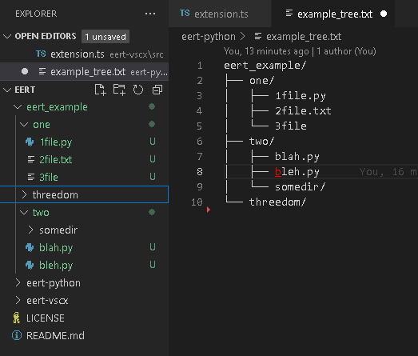

# retree - inverse tree utility

This tool essentially inverts what /usr/bin/tree -F does. It creates a real directory structure on your filesystem based on an ascii line-art tree. 

## Why?
Let's say a README shows you a tree listing, suggesting you create the same. Or an architecture/requirements document does similarly. 

Or (as was my impetus for creating this) an LLM presents you with an example structure when you ask it to look at your code and suggest a sensible grouping of the classes within your single file into some number of separate files for packaging in a library you plan to make public. 

Sure, you could manually mkdir and touch files, or you could slowly watch it come into existence as you refactor your code into multiple directories and files, but if you're like me, you want to see it on your filesystem *now* and make changes and piecemeal refactor bits here and there, so you'd like to have the structure already exist, even as empty files. (And of course, the ability to use a source of truth diagram in the form of a text art directory tree without the potential for fatfingering or overlooking something when creating a real layout on a real filesystem is an obvious plus.)

## What? 

### New! Go version under `retree-go/`

## A pure bash script developed after I nerd-sniped myself into  answering a decade+ old question about how to accomplish this in bash.
[My answer on stackoverflow](https://stackoverflow.com/a/79106673/27893564) showed the usage from the python script I had made, but after I posted the answer, it bothered me that the question was asked as a bash question and my answer required python. So...

```bash
$ git clone https://github.com/scottvr/retree/
$ cd retree/retree-bash
$ tree -F
.
└── retree.sh*

0 directories, 1 file

$ mkdir test && cd test
$ bash ../retree.sh < ../../example_tree.txt
$ tree -F
.
└── retree_example
    ├── one
    │   ├──     1file.py*
    │   ├──     2file.txt*
    │   └──     3file*
    ├── threedom
    └── two
        ├──     blah.py*
        ├──     bleh.py*
        └──     somedir
```
So now it honestly answers how to wccomplish it using bash, with no external requirements.

### Also included is a Python tool that takes stdin and does the needful. for example 
```bash
git clone https://github.com/scottvr/retree/
cd retree/retree-python
# copy a structure (but not file contents) from some example directory:
tree -F /home/user/example | python retree.py
# or from a file copied from a chat, document, etc:
$ mkdir test && cd test
$ tree -F
./

0 directories, 0 files
$ python ../retree.py < ../example_tree.txt
$ tree -F
./
└── retree_example/
    ├── one/
    │   ├── 1file.py*
    │   ├── 2file.txt*
    │   └── 3file*
    ├── threedom/
    └── two/
        ├── blah.py*
        ├── bleh.py*
        └── somedir/

6 directories, 5 files
```

### Also in the repo is a vacode extension for the same, that does it in natuve typescript, without requiring the bash, python, or go versions of retree
see the retree-vscx/ subdirectory. It has yet to be packaged so if you want to run it, open extension.ts within vscode and press F5. I'll get around to bundling it up eventually.

Here's an example of usage within vscode :



**Fun fact:**:  
I pushed an update to this repo on Oct 19, 2024 saying the vscode extension v0.0.1 was ["finally working!"](https://github.com/scottvr/retree/commit/8ee650474654d819f35bf9f978e1923c64fcccd7)

Five days later, on Oct 26, 2024,  some guy uploaded a compiled vscode extension named `retree` with the same functionality, also at v0.0.1. I only discovered this today when I tried to upload a packaged version with enhanced functionality and was told by the system  that "a package named retree already exists in the Marketplace." The publisher's page on the Marketplace links to a github repo for retree under his name, but it 404's, so I guess it's private or has been deleted.

The release notes for that package include as the last line, a part of the response from the LLM used to generate it: `Would you like me to modify the release notes further or add any other improvements we made?` :-)

Anyway, I've improved the parsing so that all versions handle the same input text in the same way, with ASCII, Unicode, `tree -F` markers, whitespace/tabs, no line decorators, indention-level look-ahead inference, and more all supported properly. The guy who coincidentally pubblished his modifications over the 0.0.1 version hasn't updated since 11/2020 but even renaming my extension won't allow me to upload it to the Marketplace, with the reason given that is is "suspicious". The Marketplace support site says they try to stop scams that mislead by  using other paackage names,  but even changing the name of my package does not work, so you may just download it from here, or clone the repo and build it yourself with `npm ci; npm run package`

## Disclaimer
This is a utility made from desire and necessity to perform a specific purpose. Utilitarian. I likely would have kept it to myself except that once I spent the time to get it working within vscode, it occurred to me that I *might* not be the only person who has ever wished this to exist, so just in case, I thought I'd put this here for you. 
